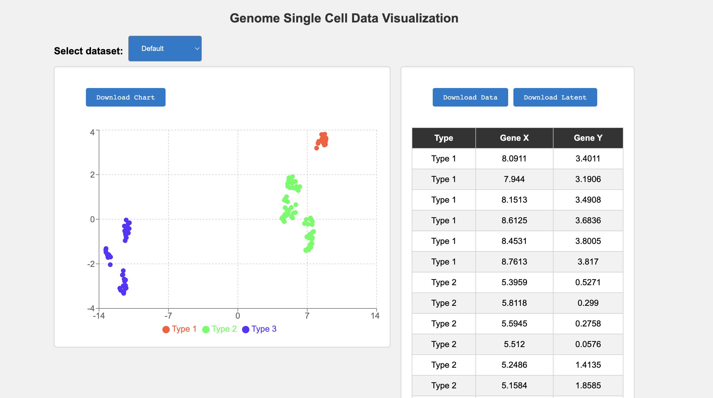

<div id="top"></div>

<br />
<div align="center">
  <h3 align="center">Single Cell Analysis</h3>

  <p align="center">
    Visualizing/Analyzing single cell data use scDHA package
    <!-- <br />
    <a href="https://github.com/othneildrew/Best-README-Template"><strong>Explore the docs »</strong></a>
    <br /> -->
    <br />
    <!-- <a href="https://visionpaws.vercel.app/">View Demo</a> -->
    ·
    <a href="https://github.com/lebinh190998/single-cell-analysis/issues">Report Bug</a>
    ·
    <a href="https://github.com/lebinh190998/single-cell-analysis">Request Feature</a>
  </p>
</div>


<!-- TABLE OF CONTENTS -->
<details>
  <summary>Table of Contents</summary>
  <ol>
    <li>
      <a href="#about-the-project">About The Project</a>
      <ul>
        <li><a href="#built-with">Built With</a></li>
      </ul>
    </li>
    <li>
      <a href="#getting-started">Getting Started</a>
      <ul>
        <!-- <li><a href="#prerequisites">Prerequisites</a></li> -->
        <li><a href="#scripts">Scripts</a></li>
      </ul>
    </li>
    <li><a href="#usage">Usage</a></li>
    <!-- <li><a href="#roadmap">Roadmap</a></li> -->
    <li><a href="#contributing">Contributing</a></li>
    <!-- <li><a href="#license">License</a></li> -->
    <li><a href="#contact">Contact</a></li>
    <!-- <li><a href="#acknowledgments">Acknowledgments</a></li> -->
  </ol>
</details>


<!-- ABOUT THE PROJECT -->
## About The Project

<a href="https://github.com/lebinh190998/single-cell-analysis">
    
</a>

<p align="right">(<a href="#top">back to top</a>)</p>


### Built With

Frameworks/libraries used to bootstrap this project.

* [expressJS](https://expressjs.com/)
* [Vite](https://vitejs.dev/)
* [React](https://react.dev/)
* [scDHA](https://bioinformatics.cse.unr.edu/software/scDHA/)

<p align="right">(<a href="#top">back to top</a>)</p>


<!-- GETTING STARTED -->
## Getting Started

To get a local copy up and running follow these simple example steps.


### Scripts

1. Clone the repo
   ```sh
   git clone https://github.com/lebinh190998/single-cell-analysis.git
   ```
2. Direct to main folder
   ```sh
   cd /path/to/single-cell-analysis 
   ```
3. Setup project
   ```sh
   npm run setup
   ```
4. Run project locally
   ```sh
   npm run dev
   ```
5. The project can be accessed at `http://localhost:5173/`
6. To test the endpoint separatedly, go to `http://localhost:9000/docs/#/`

<p align="right">(<a href="#top">back to top</a>)</p>

<!-- CONTRIBUTING -->
## Contributing

Contributions are what make the open source community such an amazing place to learn, inspire, and create. Any contributions you make are **greatly appreciated**.

If you have a suggestion that would make this better, please fork the repo and create a pull request. You can also simply open an issue with the tag "enhancement".
Don't forget to give the project a star! Thanks again!

1. Fork the Project
2. Create your Feature Branch (`git checkout -b feature/AmazingFeature`)
3. Commit your Changes (`git commit -m 'Add some AmazingFeature'`)
4. Push to the Branch (`git push origin feature/AmazingFeature`)
5. Open a Pull Request

<p align="right">(<a href="#top">back to top</a>)</p>


<!-- LICENSE -->
<!-- ## License

Distributed under the MIT License. See `LICENSE.txt` for more information.

<p align="right">(<a href="#top">back to top</a>)</p> -->


<!-- CONTACT -->
## Contact

Le Binh - [@lebinh1909](https://www.linkedin.com/in/binhle19/) - lebinh190998@gmail.com

Project Link: [https://github.com/lebinh190998/single-cell-analysis](https://github.com/lebinh190998/single-cell-analysis)

<!-- Production: [https://visionpaws.vercel.app](https://visionpaws.vercel.app/) -->
<p align="right">(<a href="#top">back to top</a>)</p>